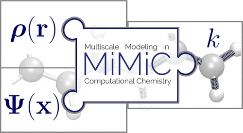

  

I am involved in the MiMiC project together with a network of various Eurpoean researchers. It involves the developement of a new QM/MM software linking the Gromacs and CPMD packges by an efficient MPI/OpenMP communication scheme.

My contributions:

- Testing of the crucial communication library and the software's scaling with the largest protein system simulated so far.

- Main developer for the MiMiCPy python wrapper around MiMiC. This allowed for easy preparation of the input files, using molecular visualization packages, and an easy to use interface to run MiMiC simulations
