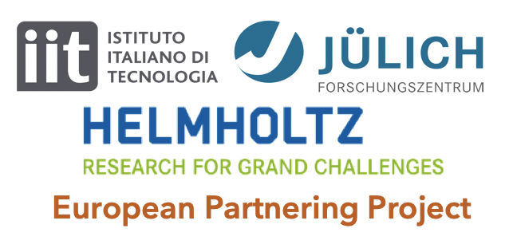

  

I am involved in the MiMiC project together with a network of various Eurpoean researchers. It involves the developement of a new QM/MM software linking the Gromacs and CPMD packges by an efficient MPI/OpenMP communication scheme.

My contributions:

- Testing of the crucial communication library and the software's scaling with the largest protein system simulated so far.

- Main developer for the MiMiCPy python interface of MiMiC. Allows for advanced 'pythonic' access of MiMiC input preparation/run functionalities. Comes with command line tools, and integration with molecular visualization packages for efficient building of MiMiC runs.

Skills demonstrated:
- Languages: C++, Python
- Colllabrative software development: Git version control, GitHub, GitLab
- Development enviornments: GCC, Intel, OpenMPI, CMake/Make, GDB
- Test driven software development: Pytest, GoogleTest, GitLab CI
- HPC cloud environment: MPI, Bash, SSH, Paramiko

  

Carried out MD and QM/MM simulations of IDH1 protein. Clustering and data analysis.
